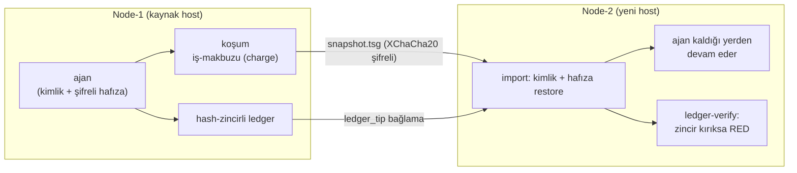

<div align="center">


[](https://github.com/goun7/tamga-protocol/actions/workflows/ci.yml)
[](#tek-komut-regresyon)
[](SECURITY-AUDIT.md)
[](LICENSE)
[](ROADMAP.md)

</div>

---

## Neden var?

Ajan-ekosisteminin üç katmanı var ve hiçbiri aradaki boşluğu doldurmuyor:

| Katman | Kim yapıyor? | Eksik olan |
|---|---|---|
| Hafıza | Mem0 · Letta · Zep | **Taşınabilirlik** — vendor'a kilitli, anahtar onlarda |
| Güven | ERC-8004 (Ethereum) | **Durum** — ajan ölünce hafıza buharlaşır |
| Ödeme | x402 | **İspat** — "iş gerçekten yapıldı" kanıtı yok |

Tamga bu boşluktadır: **şifreli + taşınabilir + denetlenebilir ajan-durumu.**
Rakip değil, tamamlayıcı — [ERC-8004 eşleme dokümanı](docs/ERC-8004-ESLEME.md) tezi kanıtlar.

## 30 saniyelik özet

```bash
# 1. Ajan çalışır (WASI 0.3 component, default-deny sandbox)
python3 tamga_runner.py run pkg/ --seed $SEED --note "gün-1"

# 2. Makine ölür — kimlik+hafıza+ledger şifreli snapshot'ta seyahat eder
python3 tamga_runner.py export pkg/ -o snapshot.tsg --seed $SEED

# 3. Yeni node'da ajan KALDIĞI YERDEN devam eder
python3 tamga_runner.py import snapshot.tsg yeni-pkg/

# 4. "Bu iş gerçekten yapıldı" — hash-zincirli makbuz doğrulanır
python3 tamga_runner.py ledger-verify yeni-pkg/   # ok: true
```

## Çekirdek güvenceler

> **Mimari bir bakışta:** ajanın kimliği + hafızası + muhasebesi şifreli `snapshot.tsg`
> ile host'tan host'a seyahat eder; iş-kanatı hash-zincirli ledger'da yaşar ve hedef
> node'da birebir doğrulanır.



- 🔐 **Bekleyen gizlilik kanıtlı** — seed asla diskte düz metin değil (XChaCha20-Poly1305
  + scrypt); disk taraması 0 sızıntı (AT-001d)
- ⛓️ **Kurcalamaya-kapalı muhasebe** — hash-zincirli ledger; truncate/splice sahteciliği
  RED (Audit-4/7/8 adversarial kanıtlarıyla)
- 🪪 **Kimlik sahiplenilir** — node-cosign L1: sunucular iş-kayıtlarına kendi sertifikasını
  basar; iptal listesi devreden-çıkanı da geçersiz kılar
- 🔁 **Determinizm zemini** — aynı wasm+girdi → birebir aynı çıktı-parmakizi
  (stake'li yeniden-koşum doğrulamasının ön-şartı)
- 🚫 **Bağlantısız & default-deny** — koşum motoru ağ-yok, fs-yok, env-yok; wasmtime v48,
  ratifiye WASI 0.3.0

## Dürüst sınırlar (v0 ne iddia ETMEZ)

- **Kullanım-anı gizlilik kanıtsız:** koşum sırasında seed host RAM'inde — TEE (Faz 3)
- **Üretim ağı değil:** simnet; tüm tutarlar `*_sim`; token/coin DEĞİLDİR
- **Ölçek:** snapshot ≤ 64MiB (güvenli-sınır); çok-node ledger birleşimi Faz 3 açık-sorusu

Açık bulgular [SECURITY-AUDIT.md](SECURITY-AUDIT.md)'de yaşar: **10 denetim turu,
25 F-bulgu + bağımsız taze-göz denetimi (20 bulgu, karar tablosuyla).** Kapatma kanıtsız yapılmaz.

## Hızlı Başlangıç

```bash
git clone <repo> && cd tamga-protocol
bash tests/run_all.sh          # 16/16 kontrol — ~6 sn

# ilk ajanın:
python3 tamga_validator.py keygen tests/keys/alici
python3 tamga_validator.py sign  <pkg>/tamga.json <pkg>/agent.wasm tests/keys/alici/seed.hex
python3 tamga_runner.py keygen                              # ajan kimliği (yalnız stdout)
export TAMGA_KS_PASSPHRASE="..."
python3 tamga_runner.py run    <pkg> --seed <hex> --note "not"
python3 tamga_runner.py export <pkg> -o snapshot.tsg --seed <hex>
# import için hedef pkg önceden kurulmalı: tamga.json + agent.wasm (kod ayrı seyahat eder)
python3 tamga_runner.py import snapshot.tsg <yeni-pkg>
python3 tamga_runner.py ledger-verify <yeni-pkg>
python3 tamga_runner.py memory <pkg> --search <q>
python3 tamga_runner.py memory <pkg> --import-json d.json   # MERGEN → Tamga köprüsü
```

## MERGEN'den geliyorsanız

Tek komutla hafızanı taşı (SQLite → şifreli snapshot; [araç](tools/mergen_batch.py),
[kanıt](kanit/ADAPTER/)): kaynak salt-okunur okunur, ara-veri RAM'de kalır,
snapshot parolanla şifrelenir. Mem0/Letta/Zep export-adaptörleri yol haritasında
([Faz 2](ROADMAP.md)) — [rehber](AGENT-REHBERI.md).

## Kanıt kültürü — projenin imzası

Her iddia bir log'la bağlı ([kanit/](kanit/)): kabul testleri, adversarial saldırı
simülasyonları, başarısız koşular da arşivde (hata yapmayı da kaydederiz).
Tek komutla doğrula: `bash tests/run_all.sh` → 16/16.

## Belgeler

| Belge | İçerik | Durum |
|---|---|---|
| [RFC-001](RFC-001-manifest.md) (şema: [specs/manifest-0.1.0.schema.json](specs/manifest-0.1.0.schema.json)) | Paket biçimi (`tamga.json`, manifest şeması) | v0.1-FINAL (donmuş) |
| [RFC-002](RFC-002-runner.md) | Runner sözleşmesi (koşum, ölçüm, snapshot) | v0.1-FINAL (donmuş, erratalı) |
| [RFC-003](RFC-003-ledger.md) | Ledger kaydı ve ölçüm sözleşmesi (`tamga-sim/1`) | v0.2 TASLAK — D8 node-cosign |
| [RFC-004](RFC-004-context-graph.md) | Bağlam grafiği ve snapshot sözleşmesi | TASLAK — kurucu onaylı kararlar işlendi |
| [SECURITY-AUDIT.md](SECURITY-AUDIT.md) | Audit-1…10 — 25 F-bulgu + bağımsız taze-göz turu | Yaşayan belge |
| [AGENT-REHBERI.md](AGENT-REHBERI.md) | Ajan geliştirici rehberi (ilk 5 dakika → taşıma) | v0 |
| [ACCEPTANCE-TESTS.md](ACCEPTANCE-TESTS.md) | AT-001/003 ailesi + tek-komut takım tanımı | 16 kontrol |
| [ROADMAP.md](ROADMAP.md) | Aşama-kapılı plan + çıkış ölçütleri | Yaşayan belge |
| [docs/ERC-8004-ESLEME.md](docs/ERC-8004-ESLEME.md) | Standart eşleme + sektör genişleme değerlendirmesi | Tasarım notu |
| [docs/PILOT-MUSTERI-STRATEJISI.md](docs/PILOT-MUSTERI-STRATEJISI.md) | Ajan-müşteri GTM (huni + ilk 30 gün) | Strateji |
| [docs/KURUM-PAKETI.md](docs/KURUM-PAKETI.md) | Şirketler için tek-sayfa değer + dürüst sınırlar | Pilot |
| [docs/REKABET-HARITASI.md](docs/REKABET-HARITASI.md) | Komşu-proje/bitiriklik haritası (kaynaklı) | Tarama |
| [docs/AJAN-EKONOMISI-ARASTIRMA-2026-09-05.md](docs/AJAN-EKONOMISI-ARASTIRMA-2026-09-05.md) | Ajan-ekonomisi akademik tarama (5 bulgu) | Tarama |
| [docs/KURUCU-KARARLARI.md](docs/KURUCU-KARARLARI.md) | Alınmış kararlar + gerekçeleri | Karar defteri |
| [kanit/](kanit/) | Tüm koşu kanıtları (log'lar) | Eklenir, silinmez |

## Tasarım İlkeleri

1. **Kanıt kültürü:** hiçbir "çalışıyor" iddiası log'suz kabul edilmez.
2. **Taşınabilirlik değişmezi:** kimlik + hafıza + muhasebe snapshot'la birlikte göç eder.
3. **ADD-only hafıza:** düğüm silinmez; düzeltme `supersedes` ile yeni düğüm ekler.
4. **Sıfır-bağımlılık çekirdek:** Python stdlib + PyNaCl. Ek bağımlılık = RFC + gerekçe.
5. **İnsan kapıları:** RFC donması, gerçek-değer taşıma, sözleşme — insan kararı.

## Yol haritası

- ✅ **Faz 1** — simnet genesis: primitif + kabul testleri + 10 denetim turu
- 🔄 **Faz 2** — sertleşme: adaptörler (MERGEN ✔), overhead-beyanı, design-partner pilotu
- 🔒 **Faz 3** — ağ: ERC-8004 kayıt + gerçek mikro-ödeme + TEE pilotu *(tetikleyicili)*
- 🔒 **Faz 4** — protokol v2: zkVM kanıt katmanı, yönetişim *(çift-tetikleyicili)*

## Katkı

Katkı öncesi [ROADMAP](ROADMAP.md) + [SECURITY-AUDIT](SECURITY-AUDIT.md) okuyun.
Değişiklik = test + kanıt logu; "çalışıyor" demek yetmez, [denetim-kapısı](docs/DENETIM-KAPISI.md) 8 adım.

## Lisans

[Apache-2.0](LICENSE) — katkıda bulunanlar patenti kullanıcılarına açar; dava açan lisansı kaybeder.
