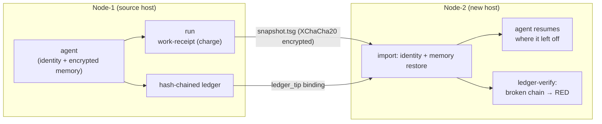
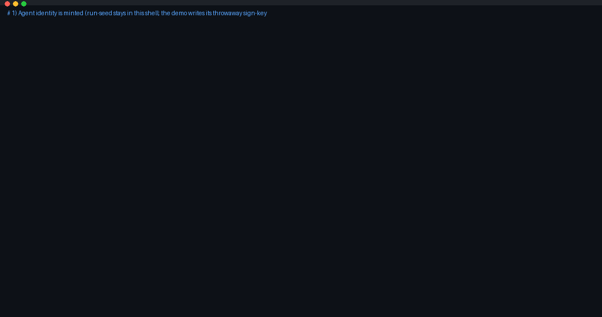

<div align="center">


[](https://github.com/goun7/tamga-protocol/actions/workflows/ci.yml)
[](#one-command-regression)
[](LICENSE)
[](#roadmap)

</div>

---

## Why does this exist?

The agent ecosystem has three layers — and none of them fills the gap between them:

| Layer | Who's building it | What's missing |
|---|---|---|
| Memory | Mem0 · Letta · Zep | **Portability** — locked to the vendor, keys on their side |
| Trust | ERC-8004 (Ethereum) | **State** — the agent dies, its memory evaporates |
| Payments | x402 | **Proof** — no verifiable evidence that "the work actually happened" |

Tamga lives in that gap: **encrypted, portable, tamper-evident agent state.**
Not a competitor — a complement. See [docs/ERC-8004-MAPPING.md](docs/ERC-8004-MAPPING.md).

## 30-second summary

```bash
# 1. The agent runs (WASI 0.3 component, default-deny sandbox)
python3 tamga_runner.py run pkg/ --seed $SEED --input job.json --require-proof

# 2. The machine dies — identity+memory+ledger travel in ONE encrypted snapshot
python3 tamga_runner.py export pkg/ -o snapshot.tsg --seed $SEED

# 3. On a new node, the agent RESUMES where it left off
python3 tamga_runner.py import snapshot.tsg new-pkg/

# 4. "This work actually happened" — the hash-chained receipts verify
python3 tamga_runner.py ledger-verify new-pkg/   # ok: true
```

## Core guarantees

- 🔐 **At-rest privacy, proven for the snapshot** — the agent seed and snapshot body
  never touch disk in plaintext (XChaCha20-Poly1305 + scrypt); the suite greps the
  encrypted snapshot body for plaintext — **0 hits** (node-side `state.json` keeps
  memory text in plaintext by design — confidentiality at rest is the snapshot's job)
- ⛓️ **Tamper-evident accounting** — hash-chained ledger; truncate/splice forgery → RED
- 🪪 **Ownership travels with the agent** — node-cosign: the node seals work-receipts
  with its own certificate; a revocation list invalidates the decommissioned node
- ⌨️ **Input-bound work receipts** — `--input` binds `input_sha256` into the receipt;
  the agent can be asked to stamp its output (`--require-proof`) and the runner
  verifies the stamp before signing the receipt
- 🔁 **Determinism ground** — same wasm + same input → identical output fingerprint
  (the precondition for stake-backed re-execution)
- 🚫 **Offline & default-deny** — the runtime has no network, no filesystem, no host env;
  wasmtime v48 on ratified WASI 0.3 components



Full technical details: [docs/ARCHITECTURE.md](docs/ARCHITECTURE.md).

## Honest limits (what v0 does NOT claim)

- **In-use privacy is unproven:** while running, the seed lives in host RAM — TEE (Phase 3)
- **Not a production network:** simnet; all amounts are `*_sim`; this is NOT a token/coin
- **Scale:** snapshot ≤ 64 MiB (safe envelope); multi-node ledger merging is an open question
- **Determinism scope is class-defined:** deterministic wasm jobs are replay-proven;
  LLM-class jobs use a different evidence contract (see ARCHITECTURE §Determinism)
- **Language surface:** core code comments, suite output and docs are English. Preserved
  Turkish by contract or design: the frozen v0.1 JSON field names (`cpu_saat`,
  `ram_gb_sn`, `fee_birebir` — renamed only by a versioned RFC), the example agent's
  proof-line narrative inside compiled .wasm artifacts, and synthetic fixture texts
  (sample memory/session contents)

Open findings are tracked in an internal audit ledger (10 adversarial rounds;
attack simulations). Disclosure process: [SECURITY.md](SECURITY.md).

## 30-second demo



The animated walkthrough: mint identity → do input-bound work on node1 → the
node "dies" → the agent revives on node2 with its memory intact → the receipt
ledger verifies. Play it yourself in one command: `bash tools/demo.sh`, or watch
the raw session: [docs/assets/demo.cast](docs/assets/demo.cast).

## Quick start

```bash
git clone https://github.com/goun7/tamga-protocol && cd tamga-protocol
python3 -m venv .venv && source .venv/bin/activate   # or: pip install --break-system-packages -r requirements.txt
pip install -r requirements.txt
bash tests/setup.sh            # one-time: installs pinned wasmtime into tools/bin/
bash tests/run_all.sh          # 19/19 controls — ~10 s

# your first agent (copy the sample vector as the package — see docs/AGENT-GUIDE §3):
python3 tamga_validator.py keygen tests/keys/alice
python3 tamga_validator.py sign  <pkg>/tamga.json <pkg>/agent.wasm tests/keys/alice/seed.hex
python3 tamga_validator.py validate <pkg>             # until ACCEPT

# run (agent identity key never touches disk — printed to stdout only):
AGENT_SEED=$(python3 tamga_runner.py keygen | python3 -c 'import sys,json;print(json.load(sys.stdin)["seed_hex"])')
export TAMGA_KS_PASSPHRASE="..."                       # your choice
python3 tamga_runner.py run    <pkg> --seed "$AGENT_SEED" --note "first run"
python3 tamga_runner.py run    <pkg> --seed "$AGENT_SEED" --input job.json --require-proof
python3 tamga_runner.py export <pkg> -o snapshot.tsg --seed "$AGENT_SEED"
# import requires the target pkg pre-provisioned (tamga.json + agent.wasm): code travels separately
python3 tamga_runner.py import snapshot.tsg <new-pkg>
python3 tamga_runner.py ledger-verify <new-pkg>
python3 tamga_runner.py memory <pkg> --search <query>
python3 tamga_runner.py memory <pkg> --import-json lessons.json   # ADD-only memory bridge
# bringing memory from another store? multi-format converter (mem0/letta/zep/jsonl):
python3 tools/memory_import.py --from export.json --format auto -o converted.json
```

## One-command regression

```bash
bash tests/run_all.sh        # 19/19 controls — families below, ~10 s on a laptop
```
Control families: snapshot lifecycle + adversarial negatives (AT-001), determinism/replay
(AT-002), ledger attack vectors (AT-003), input-bound receipts (AT-004), multi-format memory
import (AT-005), manifest-schema cross-validation (34/34), plus tokenomics/economy invariants. Details:
[docs/TESTS.md](docs/TESTS.md). CI runs the full suite on every push (ubuntu-latest,
wasmtime v48.0.1).

## 30-second live demo

```bash
bash tools/demo.sh   # born → input-bound work → dies → travels → revives → receipt verified
```
Recorded session: [docs/assets/demo.cast](docs/assets/demo.cast) (play with `asciinema`) —
expected flow: [docs/DEMO-SCRIPT.md](docs/DEMO-SCRIPT.md).

## Importing your memory

Bring existing agent memory in via JSON-lines (`--import-json`): the merge is
ADD-only and idempotent — re-importing the same source skips what's already there.
The source store is opened read-only; intermediate data stays in RAM.
Export adapters for external memory stores are on the Phase-2 roadmap.
Developer guide: [docs/AGENT-GUIDE.md](docs/AGENT-GUIDE.md).

## Documents

| Doc | Content |
|---|---|
| [docs/ARCHITECTURE.md](docs/ARCHITECTURE.md) | Technical architecture: formats, chain, cosign, reason codes, limits |
| [docs/DESIGN-PARTNERS.md](docs/DESIGN-PARTNERS.md) | Design-partner program (v0.1→v0.2): free migration + a seat in the freeze loop |
| [RELEASE.md](RELEASE.md) | v0.1.0-alpha release notes: highlights, verification, honest limits |
| [docs/RFC-001-manifest.md](docs/RFC-001-manifest.md) | Package manifest schema contract (v0.1-FINAL, frozen, English translation) |
| [docs/RFC-002-runner.md](docs/RFC-002-runner.md) | Runner API + snapshot transport contract (v0.1-FINAL, frozen, English translation) |
| [docs/RFC-003-ledger.md](docs/RFC-003-ledger.md) | Ledger record contract (DRAFT v0.1, English translation) |
| [docs/RFC-004-context-graph.md](docs/RFC-004-context-graph.md) | ADD-only context-graph contract (DRAFT v0.1, English translation) |
| [docs/AGENT-GUIDE.md](docs/AGENT-GUIDE.md) | Agent developer guide (mental model → first run → migration) |
| [docs/TESTS.md](docs/TESTS.md) | Test families + how to run + CI |
| [docs/AUDIT-GATE.md](docs/AUDIT-GATE.md) | The 8-step gate every change passes |
| [docs/DEMO-SCRIPT.md](docs/DEMO-SCRIPT.md) | 30-second demo: expected flow |
| [docs/ERC-8004-MAPPING.md](docs/ERC-8004-MAPPING.md) | ERC-8004 ↔ Tamga mapping (Phase-3 design note) |
| [specs/manifest-0.1.0.schema.json](specs/manifest-0.1.0.schema.json) | Package manifest JSON Schema |
| [SECURITY.md](SECURITY.md) | Vulnerability disclosure + reporting forms |
| [CONTRIBUTING.md](CONTRIBUTING.md) | How to contribute |

> **Language note:** deep design documents (RFC-001…005, the full audit report,
> tokenomics) are currently canonical in **Turkish**; English translations are in
> progress and will be published here progressively. Turkish README: [README.tr.md](README.tr.md).

## Roadmap

- ✅ **Phase 1** — simnet genesis: primitives + acceptance tests + 10 audit rounds
- 🔄 **Phase 2** — hardening: memory-store adapters, overhead statement, design-partner pilot
- 🔒 **Phase 3** — network: ERC-8004 registration + real micropayments + TEE pilot *(gated)*
- 🔒 **Phase 4** — protocol v2: zkVM proof layer, governance *(double-gated)*

## Contributing

Read [CONTRIBUTING.md](CONTRIBUTING.md) and the [audit gate](docs/AUDIT-GATE.md):
a change = tests + evidence. Report vulnerabilities privately via [SECURITY.md](SECURITY.md).

## License

[Apache-2.0](LICENSE) — contributors' patents extend to users; anyone filing a patent
claim loses the license.
