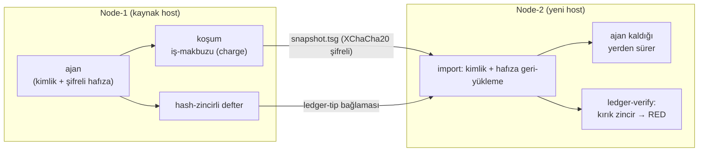

<div align="center">


<p></p>

[](https://pypi.org/project/tamga-protocol/)
[](https://github.com/goun7/tamga-protocol/actions/workflows/ci.yml)
[](#tek-komut-regresyon)
[](LICENSE)
[](#yol-haritası)

</div>

---

# Tamga Protocol — Türkçe (yerelleştirilmiş README)

> Bu dosya, İngilizce [README.md](README.md)'nin Türkçe karşılığıdır: özet-yüzeyler + derin
> teknik özet bölümleri ("Derin teknik özet" başlıkları, İngilizce garantiler ve dürüst
> sınırların kanıt-tablolarıyla aynı kapsamı taşır). Kamu RFC'lerinin özgün dili Türkçe'dir;
> İngilizce çevirileri `docs/` altında ilerler.

## Neden var?

Ajan-ekosisteminin üç katmanı var ve hiçbiri aradaki boşluğu doldurmuyor:
**Hafıza** (Mem0/Letta/Zep — taşınabilirlik yok) · **Güven** (ERC-8004 — durum yok)
· **Ödeme** (x402 — kanıt yok). Tamga bu boşluktadır: **şifreli, taşınabilir,
kurcalamaya-dirençli ajan-durumu.** Rakip değil, tamamlayıcı.

## 30 saniyelik özet

```bash
python3 tamga_runner.py run pkg/ --seed $SEED --input job.json --require-proof  # girdili iş
python3 tamga_runner.py export pkg/ -o snapshot.tsg --seed $SEED                # makine öldü
python3 tamga_runner.py import snapshot.tsg new-pkg/                            # yeni host'ta dirildi
python3 tamga_runner.py ledger-verify new-pkg/                                  # ok: true
python3 tamga_bootstrap.py project-head new-pkg/                                # zincirbaşı → dış-batch yaprak-izdüşümü
python3 tamga_pugio_receiver.py dis_cipalar.jsonl     # dış çıpa satırlarını DOĞRULA (fail-loud)
python3 tamga_pugio_ingest.py dis_bundle.json          # K0 bundle gövde-doğrulama → makbuz (RED'de makbuz YOK)
python3 tamga_bootstrap.py epoch-verify kanit.json     # DIŞ epoch-mühür dahillik-kanıtını doğrula — GREEN rc0 / RED rc1 / İNDETERMİNE rc2; ölü-RPC asla yeşil okunmaz (--rpc zincir-bacağını da koşar)
```

## Temel güvenceler

- 🔐 Diskte-düz-metin yok (XChaCha20-Poly1305 + scrypt; tarama 0 sızıntı)
- ⛓️ Hash-zincirli defter; truncate/splice sahteciliği → RED
- 🪪 node-cosign: node sertifikasıyla mühürlü iş-makbuzu + iptal-listesi
- ⌨️ `input_sha256` makbuza bağlı; `--require-proof` çıktı-kanıt-satırı koşucu-taraflı doğrulanır
- 🔁 Aynı wasm+girdi → aynı çıktı-parmakizi (stake'li yeniden-koşum ön-koşulu)
- 🚫 Default-deny kutusu: fs-preopen yok, env sıfır, ağ-yok — ağ YETENEK olarak beyan
  edilirse vekil-tek-kenarından çıkar (RFC-005 beyanlı-egress; her istek kanıt-log'unda)

Ayrıntı: [docs/ARCHITECTURE.md](docs/ARCHITECTURE.md) · Rehber: [docs/AGENT-GUIDE.md](docs/AGENT-GUIDE.md)

## Derin teknik özet — güvenceler (kanıtlarıyla)

Her güvence burada *iddia + kanıt-yeri* çifti olarak durur; süit, her iddiayı kontrol-alkışlı
negatif vektörlerle çalıştırır (`bash tests/run_all.sh` → 50/50):

| Güvence | Ne kanıtlar | Kanıt-yeri |
|---|---|---|
| **Bekleme-halinde gizlilik (snapshot için kanıtlı)** | Tohum ve gövde diskte düz-metin'e hiç değmez (XChaCha20-Poly1305 + scrypt); süit şifreli gövdeyi düz-metin için tarar — **0 eşleşme** (node tarafı `state.json`, tasarımsal olarak düz tutar; bekleme-gizliliği snapshot'ın işidir) | AT-001 ailesi; Audit-17 bayt-kurcalama negatifleri |
| **Kurcalama-kanıtlayıcı muhasebe** | Hash-zincirli defter; kesme/yapıştırma sahteciliği → RED (denetim zincirdeki boşluğu tek başına işaret eder; hasar yayılmaz) | AT-003 saldırı-vektörleri; Audit-18 ünikod-fuzz (NFC/NFD ayrımı) |
| **Sahiplik ajanla yolculuk yapar** | node-cosign: node, iş-makbuzlarını kendi sertifikasıyla mühürler; iptal-listesi kapattırılmış node'u geçersiz kılar — makbuz "hangi node'da doğdu" sorusunu da yanıtlar | AT-004; iptal yolu negatifleri |
| **Girdiye-bağlı iş-makbuzları** | `--input`, `input_sha256`'yı makbuza bağlar; ajan çıktısını damgalamaya çağrılabilir (`--require-proof`) ve koşucu, makbuzu imzalamadan önce damgayı doğrular | AT-004 doğrulama yolu; sahte-damga RED |
| **Determinizm zemini** | Aynı wasm + aynı girdi → aynı çıktı-parmakizi (stake-destekli yeniden-koşumun ön-koşulu); determinizm sınıf-tanımlıdır — LLM-sınıfı işler farklı kanıt-sözleşmesi kullanır | AT-002; AT-022 üreteç-determinizmi (çift-koşum bayt-birebir) |
| **Çevrimdışı ve default-deny** | Çalışma-zamanının ağı yok, dosya-sistemi yok, host-env yok; wasmtime v48, onaylanmış WASI 0.3 bileşenleri üzerinde | AT-006 beyanlı-egress kontrolleri; koşum-tavanı |



Çapraz yön — RFC-009 izdüşümü: kendi zincir-ucu (chain-head) dış bir batch'in yaprağı olarak
sınır-ötesi kayda *izdüşürülür* (sunum-düzeyi; D5 matematiği AT-017 ile donmuş), dış çıpalar
bizim tarafımızda `tamga_pugio_receiver.py` ile doğrulanır. Epoch-13 örneği — Apodix mührünü
kendi saf-Python keccak'ımızla iki bacakta (merkle dahil-etme + zincir-üstü root) yeniden
hesaplayıp GREEN dedik; tarifi herkes kendi makinesinde koşabilir:
[docs/VERIFY-EPOCH-ANCHOR.md](docs/VERIFY-EPOCH-ANCHOR.md) · tasarım:
[docs/RFC-009-external-chain-anchor-DRAFT.md](docs/RFC-009-external-chain-anchor-DRAFT.md).

## Dürüst sınırlar (v0 iddia ETMEZ)

- **Koşum-anı gizlilik kanıtsız:** çalışırken tohum host RAM'inde yaşar — TEE Faz 3 kapısında
- **Üretim ağı değil:** simnet; tüm tutarlar `*_sim`; bu bir token/coin DEĞİLDİR
- **Ölçek:** snapshot ≤ 64 MiB (güven-zarfı); çok-node defter-birleşmesi açık soru
- **Determinizm sınıf-tanımlı:** deterministik wasm işleri yeniden-koşum-kanıtlı; LLM-sınıfı
  işlerde farklı kanıt-kontratı (ARCHITECTURE §Determinism)
- **Dil-yüzeyi:** çekirdek kod-yorumları, süit çıktısı ve belgeler İngilizce'dir. Sözleşmeyle
  veya tasarımla korunan Türkçe: donmuş v0.1 JSON alan adları (`cpu_saat`, `ram_gb_sn`,
  `fee_birebir` — yalnız sürümlü RFC ile değişir), derlenmiş .wasm içindeki örnek ajanın
  kanıt-satırı anlatısı, sentetik fikstür metinleri

Açık bulgular iç denetim-defterinde izlenir (10 advers-tur; saldırı-simülasyonları).
İhlal-bildirim süreci: [SECURITY.md](SECURITY.md).

## Derin teknik özet — demolar ve kanıt-akışı

**30-saniye animasyon:**  — kimlik-doğumu → girdiye-bağlı iş →
node "ölür" → ajan node-2'de hafızası yerinde dirilir → makbuz-defteri doğrulanır → zincir-ucu
dış batch'e izdüşürülür → dış çıpayı bizim tarafımızda alınmış doğrularız. Kendi makinenizde
tek komutla: `bash tools/demo.sh` · Ham kayıt: [docs/assets/demo.cast](docs/assets/demo.cast)
· Beklenen akış: [docs/DEMO-SCRIPT.md](docs/DEMO-SCRIPT.md).

**Tek-komut regresyon:** `bash tests/run_all.sh` — 50/50 kontrol (~20 sn; `RUN_SLOW=1` ile
50). Kontrol-aileleri: snapshot yaşam-döngüsü + advers-negatifler (AT-001), determinizm/yeniden
koşum (AT-002), defter-saldırı vektörleri (AT-003), girdiye-bağlı makbuzlar (AT-004), çok-biçimli
hafıza-ithalatı (AT-005), manifest-şema çapraz-doğrulaması (0.2.0 terfi matrisiyle 60/60) ve
ekonomi-değişmezleri. CI her push'ta 4-Python-sürümü matrisinde tam süiti koşar (wasmtime
v48.0.1). Ayrıntı: [docs/TESTS.md](docs/TESTS.md).

**Hafızanızı ithal edin:** JSON-satırlarıyla (`--import-json`) — birleşme YALNIZ-ekleme ve
idempotenttir (aynı kaynağı yeniden ithal etmek zaten duran satırları atlar). Kaynak depo
salt-okunur açılır; ara-veri RAM'de kalır. Dış hafıza-depoları için ihraç-uyarlayıcıları Faz-2
yol-haritasındadır; çok-biçimli dönüştürücü bugün var: `tools/memory_import.py`
(`--from export.json --format auto`). Geliştirici-rehberi: [docs/AGENT-GUIDE.tr.md](docs/AGENT-GUIDE.tr.md).

## Derin teknik özet — belge haritası

| Belge | İçerik |
|---|---|
| [docs/ARCHITECTURE.md](docs/ARCHITECTURE.md) | Teknik mimari: biçimler, zincir, cosign, reason-kodları, sınırlar |
| [RFC-007-schema-revision-v02.md](docs/RFC-007-schema-revision-v02.md) | UYGULANDI: v0.2 şema revizyonu kamusal-kayıt olarak — R1 runtime.net göçü, R2 etiketli delivery_hash (safal207 düzeltmesi), R3 D12 koşullu birlik; her biri kabul-testi kanıtıyla |
| [RFC-008-external-receipt-DRAFT.md](docs/RFC-008-external-receipt-DRAFT.md) | TASLAK (pilot-öncesi): dış makbuz-bağlama şeması; pilot günü kapatacağı üç açık soru |
| [RFC-009-external-chain-anchor-DRAFT.md](docs/RFC-009-external-chain-anchor-DRAFT.md) | TASLAK (pilot-öncesi): dış zincir-çıpaları — defterimizin dış kayıt-faktlarına atıf yapması (epoch-13 kanıtı; const pilot kapısında) |
| [RFC-005-declared-egress.md](docs/RFC-005-declared-egress.md) | UYGULANDI: beyanlı-egress (vekil-modeli) — default-deny/gerçek-ajan çelişkisi ve çözümü; D12 bağı; SSRF/DNS-rebinding önlemleri |
| [RFC-006-agent-net-shim.md](docs/RFC-006-agent-net-shim.md) | UYGULANDI: ajan-tarafı ağ-shim'i (D13) — tek-kenar protokol, iki-modlu stdin disiplini, dürüst v1 sınırları |
| [RFC-001](docs/RFC-001-manifest.md) · [RFC-002](docs/RFC-002-runner.md) · [RFC-003](docs/RFC-003-ledger.md) · [RFC-004](docs/RFC-004-context-graph.md) | Temel sözleşmeler (v0.1-FINAL donmuş; Türkçe kanonik) |
| [specs/manifest-0.2.0.schema.json](specs/manifest-0.2.0.schema.json) | Paket-manifesti JSON-şeması (v0.2; 0.1.0 yasal-donmuş) |
| [docs/INDEX.md](docs/INDEX.md) | Role-göre okuma-sırası (karar-veren/yazan/doğrulayan/entegratör) + durum-sözlüğü |
| [RELEASE.md](RELEASE.md) · [CHANGELOG.md](CHANGELOG.md) | Sürüm-yüzeyleri ve değişim-günlüğü (0.2.9: `tamga liveness-probe` console; 0.2.8: E-15 zincir-bağı + liveness-probe; 0.2.7: tüm-CLI usage-guard + CR-v0.1 cross-proof; 0.2.6: aynı-gün yama — explain crash-family; 0.2.5: taze-kullanıcı denetimi — epoch-verify wheel'de; 0.2.4: ingest wheel'de + AT-026) |
| [docs/PLAIN-TURKISH.md](docs/PLAIN-TURKISH.md) | Kodsuz-dil anlatımı (Türkçe + kısa EN özet) |
| [docs/AGENT-GUIDE.tr.md](docs/AGENT-GUIDE.tr.md) | Ajan-geliştirici rehberi (zihin-modeli → ilk koşum → göç) — tam Türkçe |
| [docs/NODE-DISCOVERY.md](docs/NODE-DISCOVERY.md) | Faz-3 tasarım-notu: ERC-8004 üzerinden node keşfi (tetik-kapılı, kod yok) |
| [SECURITY.md](SECURITY.md) · [CONTRIBUTING.md](CONTRIBUTING.md) | İhlal-bildirim + katkı disiplini (değişim = test + kanıt) |

> **Dil-notu:** derin tasarım-belgeleri (RFC-001…005, tam denetim-raporu, tokenomics) şu an
> **Türkçe** kanoniktir; İngilizce çeviriler ilerler ve burada kademeli yayımlanır.

## 30-saniyelik demo


Animasyonlu-anlatım: kimlik-mint → node1'de girdiye-bağlı-iş → node "öler" → ajan node2'de
hafızası-bozulmadan-dirilir → makbuz-defteri doğrulanır → zincir-ucu yabancı bir parteye
yansıtılır → tarafımızda yabancı çıpa doğrulanır. Kendin-oyna: `bash tools/demo.sh`, ya da
ham-oturumu-izle: [docs/assets/demo.cast](docs/assets/demo.cast).

## Hızlı başlangıç

```bash
# en hızlı yol (pip-kurulumlu, tek komut — şablon-ajan + taze-anahtar + imza + İLK KOŞUM + doğrulama):
pip install tamga-protocol && tamga quickstart ilk-ajanim

# kaynaktan:
git clone https://github.com/goun7/tamga-protocol && cd tamga-protocol
python3 -m venv .venv && source .venv/bin/activate
pip install -r requirements.txt
bash tests/setup.sh      # tek-seferlik: pinli wasmtime tools/bin/'e kurulur
bash tests/run_all.sh    # 50/50 kontrol — ~20 sn (RUN_SLOW=1 ile 55)

# ilk ajanın (örnek-vektörü-paket olarak kopyala — docs/AGENT-GUIDE §3):
python3 tamga_validator.py keygen tests/keys/alice
python3 tamga_validator.py sign  <pkg>/tamga.json <pkg>/agent.wasm tests/keys/alice/seed.hex
python3 tamga_validator.py validate <pkg>             # ACCEPT'e dek

# koşum (ajan kimlik-anahtarı diske hiç-değmez — yalnız stdout'a basılır):
AGENT_SEED=$(python3 tamga_runner.py keygen | python3 -c 'import sys,json;print(json.load(sys.stdin)["seed_hex"])')
export TAMGA_KS_PASSPHRASE="..."                      # senin-seçimin
python3 tamga_runner.py run    <pkg> --seed "$AGENT_SEED" --note "ilk koşum"
python3 tamga_runner.py run    <pkg> --seed "$AGENT_SEED" --input is.json --require-proof
python3 tamga_runner.py export <pkg> -o anlik.tsg --seed "$AGENT_SEED"
python3 tamga_runner.py import anlik.tsg <yeni-pkg>   # kod AYRICA yolculuk eder — hedef paket ön-teminli olmalı
python3 tamga_runner.py ledger-verify <yeni-pkg>
python3 tamga_bootstrap.py project-head <pkg>         # zincir-ucu → parti-yaprak yansıtma (RFC-009; gösterim-only)
python3 tamga_pugio_receiver.py disicapalar.jsonl     # dış çıpa satırlarını İÇERİDE doğrula (RFC-009 alıcısı; fail-loud)
python3 tamga_pugio_ingest.py dis_bundle.json         # K0 bundle tam-gövde doğrulama → deterministik makbuz (RED'de makbuz YOK)
python3 tamga_bootstrap.py epoch-verify kanit.json    # YABANCI epoch-mührü dahil-etme-kanıtı — Yeşil rc0 / Kırmızı rc1 / İNDETERMİNE rc2; ölü-RPC asla-yeşil-okunmaz (--rpc zincir-ayağını ekler)
python3 tamga_bootstrap.py liveness-probe             # RPC-tazeliği YALNIZ blok-no-farkıyla — sunucu-duvar-saati HİÇ okunmaz (#2887 dersi); --json makine-satırı
python3 tamga_bootstrap.py attest-verify claim.json   # YABANCI teslim-attestation doğrulaması: stdlib-only secp256k1+EIP-191 — vericinin-kendi hükmünü 7/7 koprodukte eder (AT-030)
python3 tamga_bootstrap.py verify-cr doc.json --expect sha256:...  # CR-v0.1 kanonik-digest'i bizim-kanonik-yoldan yeniden-hesapla; çıplak-çağrı = hüküm-değil, ÖLÇÜM
python3 tamga_runner.py memory <pkg> --search <sorgu>
python3 tamga_runner.py memory <pkg> --import-json dersler.json    # yalnız-ekleyen bellek-köprüsü

# belleğini başka bir depodan mı taşıyorsun? çok-formatlı dönüştürücü (mem0/letta/zep/jsonl):
python3 tools/memory_import.py --from export.json --format auto -o converted.json
```

## Belleğini-sok-buraya

Var-olan ajan-hafızını JSON-satırlarıyla sok (`--import-json`): birleştirme
yalnız-ekleyen ve idempotent — aynı-kaynağı-tekrar-sokmak mevcut-olanı-atlar.
Kaynak-depo salt-okunur-açılır; ara-veri RAM'de kalır.
Dış-hafıza-depoları için dışa-aktarım adaptörleri Faz-2 yol haritasında.

Kanıt-özet araçları: `tamga ledger-verify` · `tamga verify-mini` (stdlib-yalnız) ·
`tamga bundle` (kanıt-paketi) · `tamga explain` (insan-dilli makbuz özeti; TR/EN).
Komut-seti ve ilk-ajan akışı:
[docs/AGENT-GUIDE.md](docs/AGENT-GUIDE.md) — Türkçe rehber: [docs/AGENT-GUIDE.tr.md](docs/AGENT-GUIDE.tr.md).
Belge-haritası (rol-e-göre okuma-sırası): [docs/INDEX.md](docs/INDEX.md).

## Katkıda-bulunma

Değişiklik-beri-kapısı 8-adımlı denetim-merasiminden geçer (docs/AUDIT-GATE.md); her-push'te
4-Python-sürüm matrisinde tam-süit koşar. Hata-bildirimi: SECURITY.md. Ayrıntı: CONTRIBUTING.md —
köşeli-parantezli "good first issue"lara bak; belirsizlikte İNDETERMİNE davranışımız kurallardır.

## Yol haritası

✅ Faz 1 simnet-jenerasyonu · 🔄 Faz 2 sertleştirme (adaptörler, tasarım-partner pilotu)
· 🔒 Faz 3 ağ (ERC-8004, gerçek mikro-ödeme, TEE) · 🔒 Faz 4 protokol v2 (zkVM) — kapılı.

## Lisans

[Apache-2.0](LICENSE)
