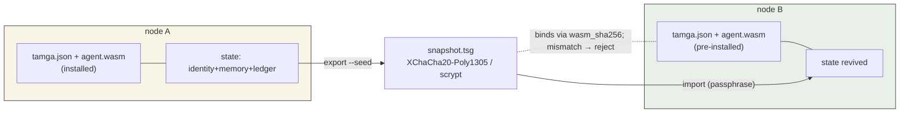
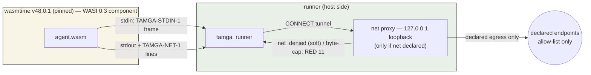
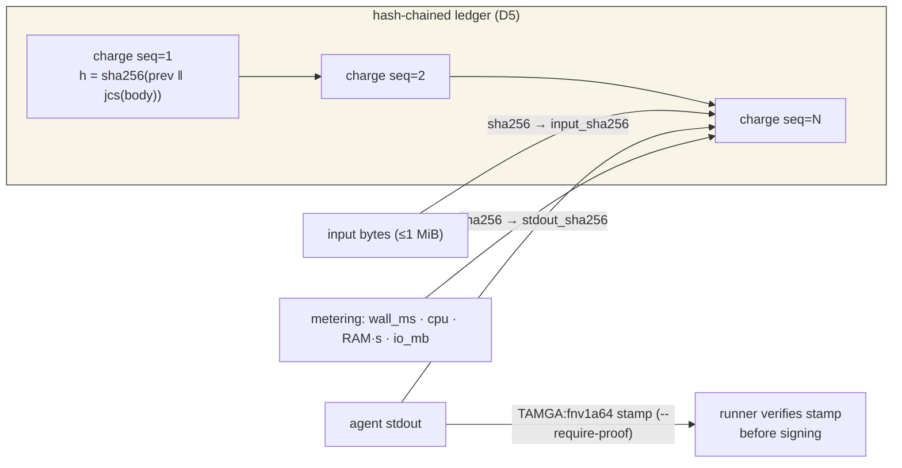
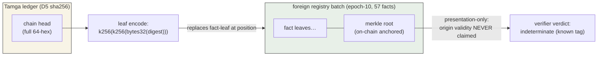

# Tamga Protocol — Technical Architecture (v0, simnet)

> Audience: engineers evaluating or building on Tamga. Every "proven" below refers to
> a runnable control in `tests/run_all.sh` (21 controls, CI-green) unless noted.
> Deep design documents (RFC-001…005, full audit report) are canonical in Turkish;
> this page summarizes the public surface.

## 1. What travels vs. what is installed

**The invariant: identity + memory + accounting migrate together; code travels separately.**

- `agent.wasm` — the code (WASI 0.3 component). Installed on each node independently.
- `tamga.json` — manifest: package identity, code hash, runtime limits, capability
  declarations, ed25519 operator signature (JCS-canonicalized).
- `snapshot.tsg` — encrypted state container: agent identity (ed25519 keypair),
  ADD-only memory graph, embedded hash-chained ledger. XChaCha20-Poly1305, key derived
  via scrypt from a user passphrase. **The seed never rests on disk in plaintext.**

A node that receives a snapshot must already hold the matching `tamga.json` +
`agent.wasm` — the snapshot binds to the code via `wasm_sha256` and rejects mismatch.



## 2. Formats

| Artifact | Format | Notes |
|---|---|---|
| Manifest | `tamga.json`, schema `specs/manifest-0.2.0.schema.json` — contract: [docs/RFC-001-manifest.md](RFC-001-manifest.md) (v0.1-FINAL) + RFC-007 v0.2 | `spec_version` pinned `"0.2.0"` (founder flip 2026-09-11); signature over JCS with `sig` emptied |
| Ledger | `tamga-sim/1` JSONL | each record: `seq` (1-based) + `prev` + `h = sha256(prev \| jcs(record))` |
| Snapshot | `tamga-snapshot/1` binary envelope | header (plaintext metadata incl. `agent_id`, `pkg_name`) + encrypted body |

Record types: `charge` (work + metering evidence), `grant` (funding), `fee` (spending — planned: v0.1 emits `charge` and `grant`; the `fee` type is reserved for the spending leg).

## 3. Runtime model



- Engine: **wasmtime v48.0.1** (pinned binary, `tools/bin/wasmtime`), target
  **WASI 0.3 / component** (ratified 2026-09).
- **Default-deny:** no sockets, no filesystem preopens, no environment access.
  Capabilities are *declared* in the manifest (`fs`, `net`, `clock`, `env`, `random`,
  ≤5) and `fs`/`net` are denied at runtime regardless in v0. Declared-egress is
  enforced by the runner-side net proxy (RFC-005A) and the agent-side net shim
  (RFC-006 D13): the egress policy lives either in the legacy `net.json` bridge or,
  since RFC-007 R1, in the manifest's `runtime.net` subtree — both present is an
  ambiguous policy (RED); `migrate-net` moves the bridge into the manifest one-way.
- **Limits (enforced):** `memory_mb [16,4096]`, `cpu_ms_per_run [1,60000]` (wall-clock
  timeout), `io_mb_per_run [0,1024]` — out-of-range manifests are rejected before execution.
- **Metering:** wall_ms, cpu-seconds, RAM·seconds, IO-MB per run → recorded in the
  `charge` record.

## 3b. Embedding Tamga in your product (integration surface)

The runner is a standalone CLI, designed to be driven as a subprocess (the
boundary is the one-line-JSON receipt on stdout — RFC-002 §3):

1. **Identity:** derive the agent seed from the user passphrase with `keygen`
   (printed once — D3 forbids persisting it; hold it in your process memory or
   your own secret store) or mint an operator key with `keygen-node` (0600 file).
2. **Package:** give the agent a directory with `tamga.json` (RFC-001) +
   `agent.wasm`; validate with `tamga_validator.py validate`, sign with
   `tamga_validator.py sign`.
3. **Run:** `tamga_runner.py run <pkg> --seed <hex>` per work unit — the receipt
   (`ok`, `op`, `fee_sim`, `stdout_sha256`, `reason_code` on RED) is your
   integration contract; the hash-chained ledger lives inside `<pkg>/ledger.jsonl`.
4. **Move:** `export` seals memory+ledger into one snapshot; `import`
   deep-verifies before installing. Verify any package state with `ledger-verify`.
5. **What NOT to do:** do not parse human-readable stderr (json only), do not
   share one `<pkg>` between two agent identities (reason 18), do not write your
   own chain-format writer (the format is frozen — RFC-003).

## 4. Work receipts and proof



- Every run appends a `charge` with metering evidence and `stdout_sha256`.
- `--input <file>` (≤1 MiB): input bytes hash into `input_sha256`, bound in the
  receipt; oversize → RED before execution. The runner stages input via a temp file
  that is deleted when the run ends (success, timeout, or error).
- `--require-proof`: the agent's stdout must end with a `TAMGA:<fnv1a64-hex>` stamp
  over its own output; the runner verifies the stamp before signing the receipt
  (mismatch → RED `output_proof_mismatch`). The stamp algorithm is implemented twice
  (Rust agent + Python runner) and cross-checked in CI.
- **Determinism, class-defined:** deterministic wasm jobs — same wasm + same input →
  byte-identical `stdout_sha256` (CI-proven, the precondition for stake-backed
  re-execution). LLM-class jobs — different evidence contract: input binding + run
  log + cosign, no replay promise. Token-consuming jobs — Phase 3/4.

## 5. Trust chain (v0: node-cosign L1)

- The node operator holds a certificate key (`keygen-node`); receipts can be sealed
  with the node's signature; a revocation list invalidates retired nodes.
- Import policies: L0 (default — accept any well-formed chain), L1 (require valid
  node cosign on every embedded record). The design contract is docs/RFC-002-runner.md (frozen v0.1)
  (canonical version is Turkish).
- Known open problem (documented, not hidden): on a fresh node, an embedded chain is
  self-attested unless cosign is enforced.

**External anchor / batch-leaf projection (RFC-009 DRAFT, AT-017 + AT-022):**



The chain head is a digest like any other; composition into a foreign batch is
shape-compatible and frozen in evidence (epoch-10 batch independently re-folded
byte-exact; the felt252 notation trap is pinned in the AT-022 family).

## 6. Memory: ADD-only context graph

- Node kinds: `note`, `fact`, `session_marker` (runner-appended).
- **ADD-only:** existing nodes/edges can never be rewritten or deleted; corrections
  append via `supersedes` edges.
- Integrity: `graph_merkle` = ordered hash over nodes+edges; mismatch on import → RED.
- Import is idempotent: re-importing the same source skips existing entries.
- Limit (documented): whoever knows the seed can mint a consistent merkle seal —
  the defense is against hosts *without* the seed.

## 7. Reason codes (rejection taxonomy)

| Code | Meaning |
|---|---|
| 1 | snapshot_bad_magic |
| 2 | snapshot_header_invalid |
| 3 | manifest_reject (incl. `code_hash_mismatch`) |
| 4 | keystore_unlock_failed |
| 6 | seed_invalid |
| 7 | snapshot_too_large (>64 MiB) |
| 8 | snapshot_replay_rollback |
| 9 | agent_identity_mismatch |
| 10 | input_invalid (oversize/malformed `--input`) |
| 11 | runtime_limit (wall-clock timeout) |
| 12 | agent_run_failed / output_proof_mismatch |
| 13 | not_component |
| 14 | ledger_broken |
| 17 | state_invalid (merkle mismatch) |
| 18 | agent_ownership_mismatch |

Codes 5, 15 and 16 are reserved (validator-tier schema failures and policy-level
rejections planned for later phases) and are not emitted by the v0.1 runner; the
frozen RFC-002 additionally mentions 5 = `proof_level_unavailable`, not implemented
in v0.1. The table above lists exactly the codes the runner can emit (code-extracted).
## 8. Overhead (measured)

Runner-side overhead per operation (excluding the wasmtime run edge), medians from
two independent measurement rounds on a loaded host: keygen 103 ms, grant 102 ms,
ledger-verify 121 ms, memory-search 107 ms, memory-import 161 ms, export (scrypt
dominates) 253 ms, import with deep verification 490 ms (the frozen RFC-002 E-11 baseline of
  421 ms was recorded earlier under different host load; the two agree on ratios,
  not absolute values). Between-operation ratios
are stable across rounds; absolute values are host-load dependent — a quiet-host
repetition and a formal "overhead < X% of run wall time" statement are Phase-2
exit criteria.

## 9. Honest security envelope

- **At rest:** proven for the snapshot (the suite greps the encrypted snapshot body
  for plaintext: 0 hits; keys sealed with scrypt). Honest scope note: the node-side
  `state.json` intentionally keeps memory TEXT in plaintext — it is a working copy,
  confidentiality at rest is the snapshot's job; operator/node keys written by
  keygen-node are 0600 plaintext files by design.
- **In use:** NOT proven — seed lives in host RAM during a run; TEE pilot is Phase 3.
- **Snapshot ≤ 64 MiB:** safe envelope; chunking is catalogued but unimplemented.
- **Multi-node ledger merge:** open problem (conflicting `seq` spaces) — the real work
  of the network phase.
- **Adversarial testing:** 6 intentionally-broken negative vectors (bad magic, tampered
  manifest, forged identity, rolled-back sessions, truncated chain, spliced chain) plus
  cosign and snapshot negatives; all expected-RED results are CI-asserted.

## 10. Repository layout

```
tamga_runner.py      run/export/import/ledger/memory/keygen-node CLI
tamga_validator.py   manifest keygen/sign/validate
tests/run_all.sh     19-control acceptance suite (CI)
tests/vectors/       tc-a1..a6 fixtures incl. intentionally-broken negatives
tests/sim/           tokenomics + economy invariants (deterministic seed)
tests/agent-src/     example agent (Rust → wasm32-wasip2)
tools/demo.sh        30-second end-to-end demo
tests/adapters/        memory import adapters (external stores)
.evidence/           (untracked) local run logs (gitignored)
```
