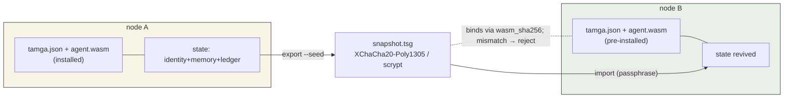
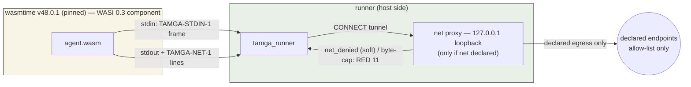
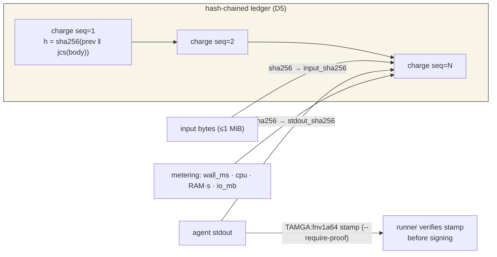
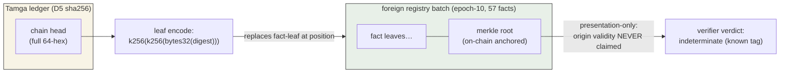

> Çeviri notu: İngilizce-orijinali ile ikizdir (kaynak: docs/ARCHITECTURE.md); teknik-kanıt-dili İngilizce kalır. Kaynak değişirse bu ikiz güncellenmeli.

# Tamga Protocol — Teknik Mimari (v0, simnet)

> Hedef kitle: Tamga'yı değerlendiren ya da üzerine inşa eden mühendisler. Aşağıdaki her
> "kanıtlanmış" ifadesi, aksi belirtilmedikçe `tests/run_all.sh` içindeki çalıştırılabilir bir kontrole
> (21 kontrol, CI-green) atıftır. Derin tasarım belgeleri (RFC-001…005, tam denetim raporu)
> kanonik olarak Türkçedir; bu sayfa kamuya açık yüzeyi özetler.

## 1. Yol alan ile kurulan şey

**Değişmez: kimlik + bellek + muhasebe birlikte göç eder; kod ayrı yol alır.**

- `agent.wasm` — kod (WASI 0.3 bileşeni). Her düğüme bağımsız olarak kurulur.
- `tamga.json` — manifest: paket kimliği, kod hash'i, çalışma zamanı sınırları,
  yetenek beyanları, ed25519 operatör imzası (JCS-kanonikleştirilmiş).
- `snapshot.tsg` — şifreli durum kapsayıcısı: ajan kimliği (ed25519 anahtar çifti),
  yalnız-ekleme (ADD-only) bellek grafiği, gömülü hash-chain defteri. XChaCha20-Poly1305; anahtar,
  kullanıcı parolasından scrypt ile türetilir. **Tohum diske asla düz metin olarak inmez.**

Snapshot alan bir düğüm, eşleşen `tamga.json` + `agent.wasm` paketini zaten
bulundurmak zorundadır — snapshot, `wasm_sha256` üzerinden koda bağlanır ve uyuşmazlığı reddeder.



## 2. Biçimler

| Artefakt | Biçim | Notlar |
|---|---|---|
| Manifest | `tamga.json`, şema `specs/manifest-0.2.0.schema.json` — sözleşme: [docs/RFC-001-manifest.md](RFC-001-manifest.md) (v0.1-FINAL) + RFC-007 v0.2 | `spec_version` `"0.2.0"` olarak sabit (kurucunun geçiş kararı 2026-09-11); imza, `sig` boşaltılmış JCS üzerinden |
| Defter | `tamga-sim/1` JSONL | her kayıt: `seq` (1-tabanlı) + `prev` + `h = sha256(prev \| jcs(record))` |
| Snapshot | `tamga-snapshot/1` ikili zarf | başlık (düz metin üstveri, `agent_id`, `pkg_name` dahil) + şifreli gövde |

Kayıt türleri: `charge` (iş + ölçüm kanıtı), `grant` (finansman), `fee` (harcama — planlanan: v0.1 `charge` ve `grant` üretir; `fee` türü harcama ayağı için ayrıldı).

## 3. Çalışma zamanı modeli



- Motor: **wasmtime v48.0.1** (sabitlenmiş ikili, `tools/bin/wasmtime`), hedef
  **WASI 0.3 / component** (2026-09'da onaylandı).
- **Varsayılan-reddet (default-deny):** soket yok, dosya sistemi preopen'ı yok, ortam erişimi yok.
  Yetenekler manifest'ta *beyan edilir* (`fs`, `net`, `clock`, `env`, `random`,
  ≤5) ve `fs`/`net` v0'da her hâlükârda çalışma zamanında reddedilir. Beyan-edilen-çıkış
  (declared-egress), runner tarafındaki net vekili (RFC-005A) ve ajan tarafındaki net shim'i
  (RFC-006 D13) tarafından zorlanır: çıkış politikası ya eski `net.json` köprüsünde ya da
  RFC-007 R1'den beri manifest'in `runtime.net` alt ağacında durur — ikisinin birden bulunması
  belirsiz politika demektir (RED); `migrate-net` köprüyü tek yönlü olarak manifest'e taşır.
- **Sınırlar (zorlanan):** `memory_mb [16,4096]`, `cpu_ms_per_run [1,60000]` (duvar saati
  zaman aşımı), `io_mb_per_run [0,1024]` — sınır dışı manifestler yürütme öncesi reddedilir.
- **Ölçüm (metering):** yürütme başına wall_ms, cpu-saniye, RAM·saniye, IO-MB → `charge`
  kaydına işlenir.

## 3b. Tamga'yı ürününüze gömme (entegrasyon yüzeyi)

Runner bağımsız bir CLI'dır ve bir alt süreç olarak sürülmek üzere tasarlanmıştır (sınır,
stdout üzerindeki tek-satırlık-JSON makbuzudur — RFC-002 §3):

1. **Kimlik:** ajan tohumunu `keygen` ile kullanıcı parolasından türetin
   (bir kez yazdırılır — D3 kalıcılaştırmayı yasaklar; süreç belleğinizde ya da kendi
   gizli deponuzda tutun) veya `keygen-node` ile operatör anahtarı üretin (0600 dosya).
2. **Paket:** ajana `tamga.json` (RFC-001) + `agent.wasm` içeren bir dizin verin;
   `tamga_validator.py validate` ile doğrulayın,
   `tamga_validator.py sign` ile imzalayın.
3. **Çalıştırma:** iş birimi başına `tamga_runner.py run <pkg> --seed <hex>` — makbuz
   (`ok`, `op`, `fee_sim`, `stdout_sha256`, RED'de `reason_code`) sizin
   entegrasyon sözleşmenizdir; hash-chain defteri `<pkg>/ledger.jsonl` içinde yaşar.
4. **Taşıma:** `export` bellek+defteri tek bir snapshot'ta mühürler; `import`
   kurulumdan önce derin doğrulama yapar. Herhangi bir paket durumunu `ledger-verify` ile doğrulayın.
5. **Yapmamanız gerekenler:** insan-okunur stderr'i çözümlemeyin (yalnızca json), iki ajan
   kimliği arasında tek bir `<pkg>` paylaşmayın (gerekçe 18), kendinizin bir zincir-biçimi
   yazıcısını yazmayın (biçim dondurulmuştur — RFC-003).

## 4. İş makbuzları ve kanıt



- Her yürütme, ölçüm kanıtı ve `stdout_sha256` içeren bir `charge` kaydı ekler.
- `--input <file>` (≤1 MiB): girdi baytları `input_sha256`'ya hash'lenir ve makbuza
  bağlanır; boyut aşımı → yürütme öncesi RED. Runner girdiyi, yürütme bittiğinde (başarı,
  zaman aşımı ya da hata) silinen bir geçici dosyayla aşamalar.
- `--require-proof`: ajanın stdout'u, kendi çıktısı üzerinden hesaplanmış bir `TAMGA:<fnv1a64-hex>`
  damgasıyla bitmelidir; runner, makbuzu imzalamadan önce damgayı doğrular
  (uyuşmazlık → RED `output_proof_mismatch`). Damga algoritması iki kez uygulanmıştır
  (Rust ajan + Python runner) ve CI'da çapraz kontrol edilir.
- **Determinizm, sınıf-tanımlı:** deterministik wasm işleri — aynı wasm + aynı girdi →
  bayt-birebir `stdout_sha256` (CI ile kanıtlanmış; stake destekli
  yeniden-yürütmenin ön koşulu). LLM-sınıfı işler — farklı bir kanıt sözleşmesi: girdi bağlama + yürütme
  günlüğü + cosign, yeniden-yürütme sözü yok. Token-tüketen işler — Faz 3/4.

## 5. Güven zinciri (v0: node-cosign L1)

- Düğüm operatörü bir sertifika anahtarı tutar (`keygen-node`); makbuzlar düğümün imzasıyla
  mühürlenebilir; bir iptal listesi (revocation list) emekli düğümleri geçersiz kılar.
- İçe-aktarma politikaları: L0 (varsayılan — iyi-biçimli her zinciri kabul eder), L1 (gömülü
  her kayıtta geçerli düğüm cosign'u şart koşar). Tasarım sözleşmesi docs/RFC-002-runner.md (donmuş v0.1)
  (kanonik sürümü Türkçedir).
- Bilinen açık problem (belgelenmiş, gizlenmez): yeni bir düğümde, cosign zorunlu kılınmadıkça
  gömülü zincir kendi-kendine-kanıtlıdır (self-attested).

**Dış çıpa / batch-leaf projeksiyonu (RFC-009 TASLAK, AT-017 + AT-022):**



Zincir başı, herhangi bir özet (digest) gibi sıradan bir özet'tir; yabancı bir batch içine
birleştirme biçim-uyumludur ve kanıtla dondurulmuştur (epoch-10 batch'i bağımsız olarak
bayt-birebir yeniden katlandı; felt252 gösterim tuzağı AT-022 ailesinde sabitlendi).

## 6. Bellek: yalnız-ekleme bağlam grafiği

- Düğüm türleri: `note`, `fact`, `session_marker` (runner ekler).
- **Yalnız-ekleme:** mevcut düğüm/kenarlar asla yeniden yazılamaz ya da silinemez; düzeltmeler
  `supersedes` kenarlarıyla sona eklenir.
- Bütünlük: `graph_merkle` = düğümler+kenarlar üzerinde sıralı hash; içe-aktarımda uyuşmazlık → RED.
- İçe-aktarma idempotenttir: aynı kaynağı yeniden içe-aktarmak mevcut girdileri atlar.
- Sınır (belgelenmiş): tohumu bilen herkes tutarlı bir merkle mührü basabilir —
  savunma, tohumu *olmayan* ana maklilere karşıdır.

## 7. Gerekçe kodları (reddetme taksonomisi)

| Kod | Anlam |
|---|---|
| 1 | snapshot_bad_magic |
| 2 | snapshot_header_invalid |
| 3 | manifest_reject (`code_hash_mismatch` dahil) |
| 4 | keystore_unlock_failed |
| 6 | seed_invalid |
| 7 | snapshot_too_large (>64 MiB) |
| 8 | snapshot_replay_rollback |
| 9 | agent_identity_mismatch |
| 10 | input_invalid (boyut aşımı/bozuk `--input`) |
| 11 | runtime_limit (duvar saati zaman aşımı) |
| 12 | agent_run_failed / output_proof_mismatch |
| 13 | not_component |
| 14 | ledger_broken |
| 17 | state_invalid (merkle uyuşmazlığı) |
| 18 | agent_ownership_mismatch |

5, 15 ve 16 kodları saklıdır (sonraki fazlara planlanan doğrulayıcı-katmanı şema
hataları ve politika-düzeyi reddetmeler) ve v0.1 runner bunları yaymaz; donmuş
RFC-002 ek olarak 5 = `proof_level_unavailable`'dan da söz eder, v0.1'de
uygulanmamıştır. Yukarıdaki tablo, tam olarak runner'ın yayabileceği kodları listeler (koddan çıkarılmıştır).
## 8. Ek yük (ölçüldü)

İşlem başına runner-tarafı ek yük (wasmtime yürütme kenarı hariç), yüklü bir ana
makinede iki bağımsız ölçüm turundan medyanlar: keygen 103 ms, grant 102 ms,
ledger-verify 121 ms, memory-search 107 ms, memory-import 161 ms, export (baskın olan
scrypt) 253 ms, derin doğrulamalı import 490 ms (donmuş RFC-002 E-11 taban değeri olan
  421 ms daha önce farklı bir ana makine yükünde kaydedilmişti; ikisi oranlarda
  anlaşır, mutlak değerlerde değil). İşlemler-arası oranlar
turlar boyunca stabildir; mutlak değerler ana makine yüküne bağlıdır — sessiz bir ana makinede
tekrar ve biçimsel bir "ek yük, yürütme duvar saatinin %X'inden az" ifadesi, Faz-2
çıkış ölçütleridir.

## 9. Dürüst güvenlik zarfı

- **Depolarda (at rest):** snapshot için kanıtlanmıştır (suite, şifreli snapshot gövdesini
  düz metin için grep'ler: 0 isabet; anahtarlar scrypt ile mühürlüdür). Dürüst kapsam notu: düğüm-tarafındaki
  `state.json` bellek METNİNİ kasıtlı olarak düz metin tutar — bu bir çalışma kopyasıdır,
  depolarda gizlilik snapshot'ın işidir; keygen-node'un yazdığı operatör/düğüm
  anahtarları tasarım gereği 0600 düz-metin dosyalardır.
- **Kullanımda (in use):** kanıtlanmadı — tohum, yürütme sırasında ana makine RAM'inde durur; TEE pilotu Faz 3.
- **Snapshot ≤ 64 MiB:** güvenli zarf; parçalama (chunking) kataloglandı ama uygulanmadı.
- **Çok-düğümlü defter birleştirmesi:** açık problem (çakışan `seq` uzayları) — ağ
  fazının gerçek işi.
- **Düşmanca testler (adversarial):** 6 kasıtlı-kırık negatif vektör (kötü magic, tahrif
  edilmiş manifest, sahte kimlik, geri alınmış oturumlar, kesilmiş zincir, birleştirilmiş zincir) artı
  cosign ve snapshot negatifleri; tüm beklenen-RED sonuçlar CI'da doğrulanır.

## 10. Depo yapısı

```
tamga_runner.py      run/export/import/ledger/memory/keygen-node CLI
tamga_validator.py   manifest keygen/sign/validate
tests/run_all.sh     19-control acceptance suite (CI)
tests/vectors/       tc-a1..a6 fixtures incl. intentionally-broken negatives
tests/sim/           tokenomics + economy invariants (deterministic seed)
tests/agent-src/     example agent (Rust → wasm32-wasip2)
tools/demo.sh        30-second end-to-end demo
tests/adapters/        memory import adapters (external stores)
.evidence/           (untracked) local run logs (gitignored)
```
